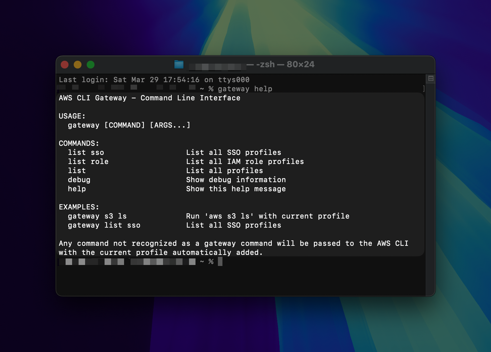

# AWS CLI Gateway

<p align="center">
    
</p>

## Overview

A menu bar macOS application that simplifies the management of AWS profiles and sessions, with a focus on AWS SSO.

## What's New in Version 0.4.0

- **Session Management Improvements**: Added the ability to clear cache for active sessions on quit
- **New Tools & Settings Menu**: Reorganized options into a dedicated submenu for better organization
- **Install CLI Tools**: Simplified access to terminal integration (formerly "Install Terminal Commands")
- **AWS Console Access**: Quickly open the AWS Console for your active session directly from the menu
- **UI Refinements**: Enhanced menu organization and visual clarity
- **Official Signing**: App is now signed with an Apple Developer ID for seamless installation

### [View the previous release notes](Release%20Notes.md)

## Features

AWS CLI Gateway offers a comprehensive set of features to streamline your AWS profile management:

1. **AWS Profile Management**
   - **SSO Profiles**: Create and manage AWS Single Sign-On profiles with support for permission sets
   - **IAM Role Profiles**: Configure profiles that assume IAM roles from source profiles
   - **Connected Profile**: Simply click the star next to any profile to connect to it

2. **Session Management**
   - **Session Monitoring**: Track remaining time of active AWS SSO sessions
   - **Visual Indicators**: Color-coded status indicators show session state at a glance
   - **Automatic Session Renewal**: Renew sessions before they expire
   - **Session Expiration Handling**: Clear notifications when sessions expire
   - **Cache Management**: Option to clear SSO cache when quitting with active sessions

3. **Menu Bar Integration**
   - **Quick Access**: Connect to profiles directly from your macOS menu bar
   - **Session Timer**: View remaining session time without opening the main app
   - **Status Indicators**: See session status with visual cues
   - **Tools & Settings**: Dedicated submenu for application utilities and preferences

4. **Terminal Integration**
   - **Gateway Command**: Use the ```gateway``` command to run AWS CLI commands with your connected profile
   - **Profile Listing**: Easily list available profiles with ```gateway list``` or specific profile types with ```gateway list sso```
   - **Seamless Experience**: Work with the same profile in both GUI and terminal without manual switching

## Installation

Download the latest release from the Release Page and move the application to your Applications folder. The app is signed with an Apple Developer ID for seamless installation.

### Build from Source

1. Clone this repository:
   ```
   git clone https://github.com/yourusername/aws-cli-gateway.git
   cd aws-cli-gateway
   ```

2. Open the project in Xcode:
   ```
   open AWS_CLI_Gateway.xcodeproj
   ```

3. Build the application:
   - Select **Product > Archive** from the menu
   - When the Archive window appears, select **Distribute App**
   - Choose **Custom** and click **Next**
   - Select **Copy App** and choose a destination folder
   - Click **Export**

4. Move the exported ```.app``` file to your Applications folder

## Terminal Integration

To install the ```gateway``` command:

1. Click on the AWS CLI Gateway menu bar icon
2. Select **Tools & Settings > Install CLI Tools**
3. Provide your administrator password when prompted

Once installed, you can use commands like:

```bash
# Run AWS commands with your connected profile
gateway s3 ls
gateway ec2 describe-instances

# List available profiles
gateway list
gateway list sso
gateway list role

# Get help
gateway help

# Display debug information
gateway debug
```

The ```gateway``` command automatically uses whichever profile is currently connected in the AWS CLI Gateway app.

## Screenshots





## Requirements

- macOS 12 (Monterey) or later
- AWS CLI (v2) must be installed and configured
- AWS SSO must be configured for your organization
- Python 3 (pre-installed on macOS) for terminal integration

## Usage

1. Launch AWS CLI Gateway
2. Click "Add Profile" to set up your first AWS profile
3. Connect to your profile by clicking the star icon next to it
4. Run AWS CLI commands in terminal using the ```gateway``` command

## Contributing

Contributions are welcome! Please reach out if you'd like to contribute to this project.

## Future Features/Ideas

- **IAM Profile Management**:
    - **Secure Credential Storage**: Store your credentials securely in macOS Keychain instead of plaintext
    - **Credential Rotation**: Built-in reminders for rotating access keys per security best practices
- **Enhanced Profile Organization**:
    - **Profile grouping**: Organize profiles by account, region, or custom groups
    - **Tagging**: Apply custom tags to profiles
- **Enhanced Terminal Integration**:
    - **Custom Commands**: Create aliases for complex AWS CLI commands
    - **Auto-Completion**: Context-aware command completion
- **AWS CLI Config File Management**